# Proyecto - Recursividad en java
# Cambios recientes


- Los algoritmos de mezcla y selección ahora cuentan con clases genéricas, permitiendo comparar cualquier campo de los estudiantes (por ejemplo, edad o nombre) usando un comparador concreto (`ComparadorEdad`, `ComparadorNombre`).
- Se agregaron pruebas automatizadas en `AppTest.java` para validar el ordenamiento genérico de estudiantes por nombre y por edad, tanto con mezcla como con selección.
- Los nombres de los tests ahora son más descriptivos: `testOrdenarPorNombreMezcla`, `testOrdenarPorNombreSeleccion`, `testOrdenarPorEdadMezcla`, `testOrdenarPorEdadSeleccion`.
- Se corrigió la instrumentación de los contadores de iteraciones en el algoritmo de mezcla para que solo cuenten comparaciones, permitiendo una comparación justa con selección.
- Se separaron los contadores por criterio (edad y nombre) y por tipo de algoritmo (iterativo y recursivo).
- Se agregó explicación educativa sobre por qué mezcla puede tener más comparaciones pero sigue siendo más eficiente que selección para listas grandes.
- Se creó la clase `PerformanceSeleccionVsMezcla` para medir y comparar el rendimiento de ambos algoritmos, tomando los datos de los estudiantes desde un archivo de texto.

El objetivo de este proyecto es implementar y demostrar el uso de algoritmos recursivos en Java. A través de una serie de clases, se exploran diferentes problemas y soluciones que se pueden abordar utilizando la recursión. Cada clase en el proyecto está diseñada para resolver un problema específico, ya sea mediante métodos iterativos o recursivos, permitiendo así una comparación directa entre ambos enfoques.

### Clases Implementadas

- **Alfabeto**: Imprime el alfabeto de manera iterativa y recursiva.
- **BusquedaBinaria**: Realiza una búsqueda binaria en un arreglo de manera iterativa y recursiva.
- **Factorial**: Calcula el factorial de un número de manera iterativa y recursiva.
- **Fibonacci**: Calcula el n-ésimo número de Fibonacci de manera iterativa y recursiva.
- **Hanoi**: Resuelve el problema de las Torres de Hanoi de manera recursiva.
- **Incremento**: Incrementa un valor dado.
- **MaximoComunDivisor**: Calcula el máximo común divisor de dos números de manera iterativa y recursiva.
- **MuestraNaturales**: Muestra números naturales de manera iterativa y recursiva.
 - **OrdenamientoMezcla**: Algoritmo genérico que ordena arreglos de cualquier tipo usando un comparador concreto (por ejemplo, `ComparadorEdad` o `ComparadorNombre`). Permite ordenar estudiantes por cualquier campo, de manera iterativa y recursiva.
 - **OrdenamientoSeleccion**: Algoritmo genérico que ordena arreglos de cualquier tipo usando un comparador concreto. Permite ordenar estudiantes por cualquier campo, de manera iterativa y recursiva.
- **Pared**: Dibuja una pared de manera recursiva.
- **ParImparRecursivo**: Determina si un número es par o impar de manera recursiva.
- **SumaDigitos**: Suma los dígitos de un número de manera iterativa y recursiva.


## Diagrama de clases
[Editor en línea](https://mermaid.live/)

```mermaid
---
title: Recursividad versus Iteratividad
---
classDiagram
      class Alfabeto {
        +main(String[] args)
        +metodoA(char c)
        +metodoB(char c)
    }

    class BusquedaBinaria {
        +int busquedaBinaria_iterativa(int[] arreglo, int valor)
        +int busquedaBinaria_recursiva(int[] arreglo, int valor, int inicio, int fin)
    }

    class Factorial {
        +long factorial_iterativo(int x)
        +long factorial_recursivo(int x)
    }

    class Fibonacci {
        +main(String[] args)
        +int fibonacci_recursivo(int n)
        +int fibonacci_iterativo(int n)
    }
    class Hanoi {
        +void hanoi(char varinicial, char varcentral, char varfinal, int n)
    }
    class Incremento {
        +main(String[] args)
        +int incrementar(int a)
    }
    class Incremento {
        +main(String[] args)
        +int incrementar(int a)
    }
    class MuestraNaturales {
        +main(String[] args)
        +void muestraNaturales_iterativa(int x)
        +void muestraNaturales_recursiva(int x)
    }
    class OrdenamientoMezcla {
        +int[] ordenar_iterativo(int[] ArregloA, int[] ArregloB)
        +int[] ordenar_recursivo(int[] ArregloA, int[] ArregloB)
        -void ordenar_recursivo_helper(int[] ArregloA, int i, int[] ArregloB, int j, int[] ArregloC, int k)
    }
    class OrdenamientoMezcla {
        +int[] ordenar_iterativo(int[] ArregloA, int[] ArregloB)
        +int[] ordenar_recursivo(int[] ArregloA, int[] ArregloB)
        -void ordenar_recursivo_helper(int[] ArregloA, int i, int[] ArregloB, int j, int[] ArregloC, int k)
    }
    class Pared {
        +void dibujar_pared(int n)
        +void main(String[] args)
    }
    class ParImparRecursivo {
        +main(String[] args)
        +boolean esPar(int n)
        +boolean esImpar(int n)
    }
    class SumaDigitos {
        +int sumaDigitos_iterariva(int n)
        +int sumaDigitos_recursiva(int n)
    }
```

[Referencia-Mermaid](https://mermaid.js.org/syntax/classDiagram.html)

## Diagrama de clases UML con draw.io
El repositorio está configurado para crear Diagramas de clases UML con ```draw.io```. Para usarlo simplemente agrega un archivo con extensión ```.drawio.png```, das doble clic sobre el mismo y se activará el editor ```draw.io``` incrustado en ```VSCode``` para edición. Asegúrate de agregar las formas UML en el menú de formas del lado izquierdo (opción ```+Más formas```).

## Uso del proyecto con make

### Default - Compilar+Probar+Ejecutar
```
make
```
### Compilar
```
make compile
```
### Probar todo
```
make test
```
### Ejecutar App
```
make run
```
### Limpiar binarios
```
make clean
```
## Comandos Git-Cambios y envío a Autograding

### Por cada cambio importante que haga, actualice su historia usando los comandos:
```
git add .
git commit -m "Descripción del cambio"
```
### Envíe sus actualizaciones a GitHub para Autograding con el comando:
```
git push origin main
```
## Comandos individuales
### Compilar

```
find ./ -type f -name "*.java" > compfiles.txt
javac -d build -cp lib/junit-platform-console-standalone-1.5.2.jar @compfiles.txt
```
Ejecutar ambos comandos en 1 sólo paso:

```
find ./ -type f -name "*.java" > compfiles.txt ; javac -d build -cp lib/junit-platform-console-standalone-1.5.2.jar @compfiles.txt
```


### Ejecutar Todas la pruebas locales de 1 Test Case

```
java -jar lib/junit-platform-console-standalone-1.5.2.jar -class-path build --select-class miTest.AppTest
```
### Ejecutar 1 prueba local de 1 Test Case

```
java -jar lib/junit-platform-console-standalone-1.5.2.jar -class-path build --select-method miTest.AppTest#appHasAGreeting
```
### Ejecutar App
```
java -cp build miPrincipal.Principal
```
Los comandos anteriores están considerados para un ambiente Linux. [Referencia.](https://www.baeldung.com/junit-run-from-command-line)

## Pruebas automatizadas

Las pruebas automatizadas en `miTest/AppTest.java` incluyen:

- `testOrdenarPorNombreMezcla`: Verifica el ordenamiento genérico de estudiantes por nombre usando mezcla.
- `testOrdenarPorNombreSeleccion`: Verifica el ordenamiento genérico de estudiantes por nombre usando selección.
- `testOrdenarPorEdadMezcla`: Verifica el ordenamiento genérico de estudiantes por edad usando mezcla.
- `testOrdenarPorEdadSeleccion`: Verifica el ordenamiento genérico de estudiantes por edad usando selección.
- `testPerformanceOutput`: Valida la salida y los contadores de la clase `PerformanceSeleccionVsMezcla`.

Ejecuta todas las pruebas con:
```
make test
```
o directamente:
```
java -jar lib/junit-platform-console-standalone-1.5.2.jar -class-path build --select-class miTest.AppTest
```

## Explicación educativa: ¿Por qué mezcla es más eficiente?

El algoritmo de mezcla (merge sort) puede realizar más comparaciones que selección, pero su eficiencia se debe a su complejidad $O(n \log n)$, mientras que selección es $O(n^2)$. Para listas grandes, mezcla termina mucho más rápido, aunque cuente más comparaciones. Esto se debe a que el número de pasos crece más lento en merge sort que en selection sort.
